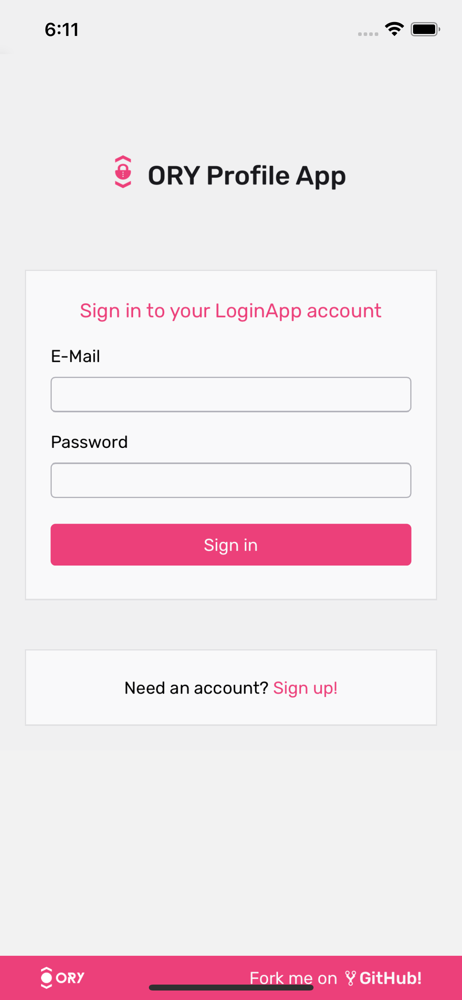
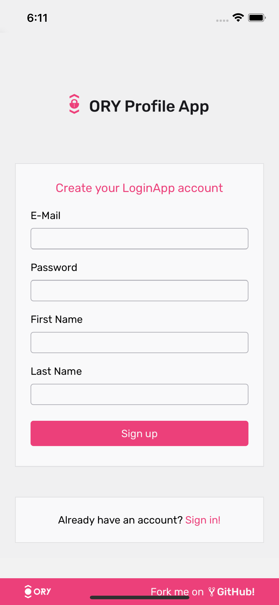
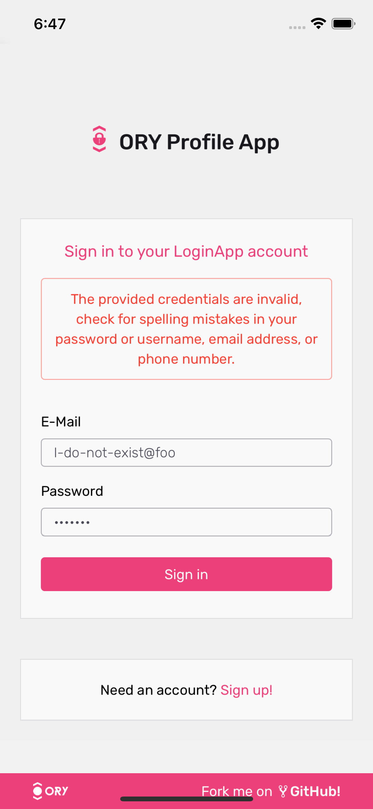
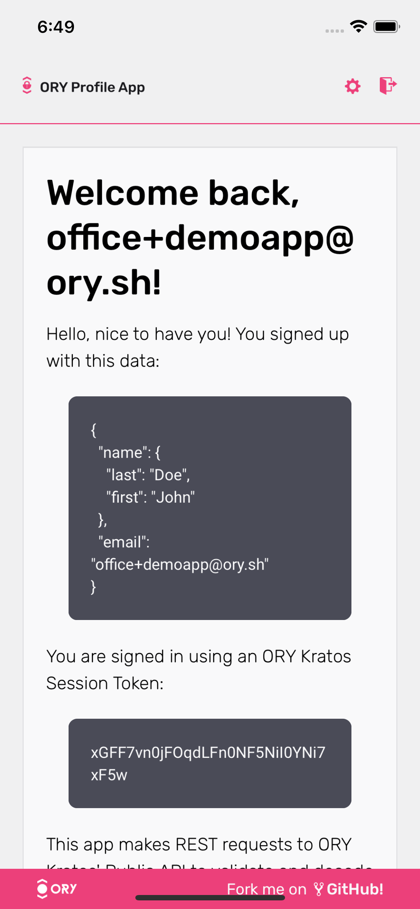
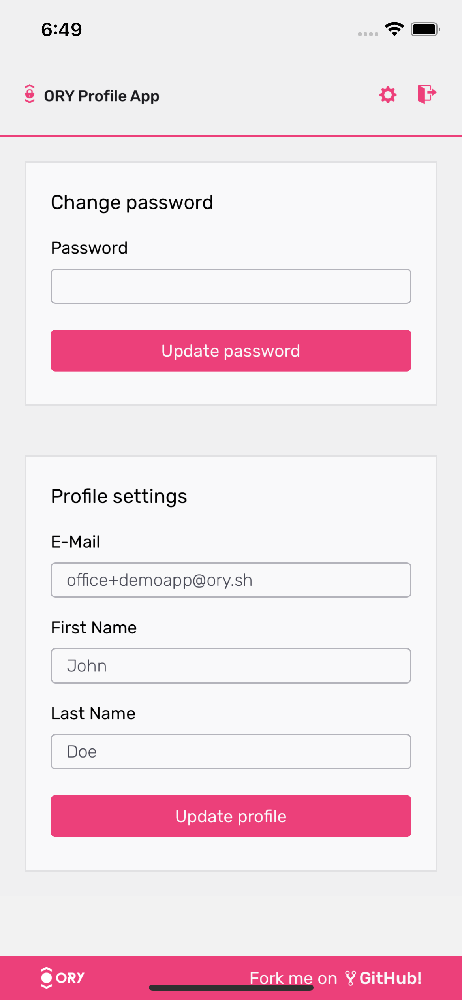

import CodeFromRemote from '@theme/CodeFromRemote'

This guide explains how to implement login, registration, logout, profile management,
password change, and many other profile-related flows in React Native using the open source
[ORY Kratos](https://www.ory.sh/kratos) project step-by-step.

<table><tr><td>



</td><td>


</td><td>



</td><td>



</td><td>



</td></tr></table>

In the future, this guide will also cover Two-Factor-Authentication (2FA/MFA), "Sign in with Google", password reset, email verification,
phone number and SMS verification, "Sign in with GitHub", "Sign in with Facebook", and many other flows.

:::note

If you just want to check out the app, download it from the [Apple App Store](https://apps.apple.com/fj/app/ory-profile-app/id1536546333)
or the Google App Store (to be released soon)! You can also check out the source code of our [ORY Kratos React Native reference implementation](https://github.com/ory/kratos-selfservice-ui-react-native).
This guide covers how you would start such a project from scratch.

:::

## Login, Registration, User Management React Native Template for Expo

This guide assumes that you have worked with React and React Native before as we
will not cover React fundamentals and focus mostly on implementing login,
registration, and so on.

To make things a bit easier, we will use [`expo`](https://expo.io). At minimum, you need
NodeJS and NPM installed locally. We will use the ORY Kratos React Native Login, Registration, and
Profile Management template:

```shell script
$ npm install -g expo-cli
$ expo init login-signup-app -t @oryd/expo-login-registration-template
$ cd login-signup-app
# We also want to install and initialize all require components:
$ npm run expo-install
$ npm run pod-install
```

If you want to just start exploring, you can now simply run:

- `npm start` opens a dashboard where you can open iOS, Android, or web.
- `npm run android` opens the app as an android app.
- `npm run ios` opens the app in the iOS simulator.
- `npm run web` opens the app as a browser app.


Running these commands directly will use our hosted demo environment of ORY Kratos at [demo.tenants.staging.oryapis.dev](https://demo.tenants.staging.oryapis.dev).
This is configured in `app.config.js`:

<CodeFromRemote
    lang="js"
    title="app.config.js"
    src="https://raw.githubusercontent.com/ory/kratos-selfservice-ui-react-native/master/app.config.js"
/>


:::note

If you wish to get your own demo environment, reach out to [jared@ory.sh](mailto:jared@ory.sh).

:::

You can also run ORY Kratos on your local machine in Docker instead!

## Run ORY Kratos Login, Registration, 2FA Server in Docker

To run the app against a local deployment, check out [ORY Kratos](https://www.ory.sh/kratos) locally and run the
quickstart:

```shell script
$ git clone https://github.com/ory/kratos.git
$ cd kratos
$ git checkout v0.5.4-alpha.1
$ docker-compose -f quickstart.yml -f quickstart-standalone.yml up --build --force-recreate -d
```

Next you need a tool like [`ngrok`](https://ngrok.com) to set up port forwarding for the ORY Kratos Docker Image
you just started:

```shell script
$ ngrok http 4433

Account                       ...
Version                       ...
Region                        ...
Web Interface                 ...
Forwarding                    ...
Forwarding                    https://04ee3e08367a.ngrok.io -> http://localhost:4433

Connections                   ttl     opn     rt1     rt5     p50     p90
                              0       0       0.00    0.00    0.00    0.00
```

Copy the HTTPS forwarding URL (example from above `https://04ee3e08367a.ngrok.io`) and set it, in a new terminal, as
an environment variable and start the app:

```shell script
# Change into the directory of your react native app:
$ cd login-signup-app
$ KRATOS_URL=<the-ngrok-url> start
# For example:
# $ export KRATOS_URL=https://04ee3e08367a.ngrok.io
```

Now, your app will use the local deployment of ORY Kratos with your own database!

## React Native Navigation with Authentication Session

The entrypoint for the app is [`App.tsx`](https://github.com/ory/kratos-selfservice-ui-react-native/blob/master/App.tsx).
Besides loading some fonts and setting up the views, this component includes the structure of the application - including
the navigation:

<CodeFromRemote
    lang="jsx"
    title="App.tsx"
    url={"https://github.com/ory/kratos-selfservice-ui-react-native/blob/master/App.tsx#L37-L65"}
/>

The most interesting component here is probably the `<AuthProvider>`. This components adds an authentication
/ login context to the React Native component tree:

<CodeFromRemote
    lang="jsx"
    title="src/components/AuthProvider.tsx"
    url={"https://github.com/ory/kratos-selfservice-ui-react-native/blob/master/src/components/AuthProvider.tsx#L34-L9999"}
/>

The helper methods in [`src/helpers/auth.tsx`](https://github.com/ory/kratos-selfservice-ui-react-native/blob/master/src/helpers/auth.tsx)
are simple wrappers around Expo's [SecureStore](https://docs.expo.io/versions/latest/sdk/securestore/). In order to work
on the web as well, we use `@react-native-community/async-storage` as a fallback:

<CodeFromRemote
    lang="jsx"
    title="src/helpers/auth.tsx"
    url={"https://github.com/ory/kratos-selfservice-ui-react-native/blob/master/src/helpers/auth.tsx#L20-L9999"}
/>

That's all the magic! Everything else is handled by [ORY Kratos' Session Token](https://www.ory.sh/kratos/docs/guides/login-session).

We now have a place to store and refresh the user session. And we have a way to see if the
user session is still active in the navigation and show the dashboard or login / registration screens:

<CodeFromRemote
    lang="jsx"
    title="src/components/Navigation.tsx"
    url={"https://github.com/ory/kratos-selfservice-ui-react-native/blob/master/src/components/Navigation.tsx#L39-L9999"}
/>

## React Native Screens

Let's take a look at the different screens! In order to not write a form renderer for every component, including styling,
we abstracted the form rendering into their own components, which you can find in
[`src/components/Form`](https://github.com/ory/kratos-selfservice-ui-react-native/tree/master/src/components/Form).

There isn't anything special happening there, but you can give it a look if you intend on changing the layout for example.

### Login Navigation Component

The User Login component uses the ORY Kratos TypeScript SDK and the [User Login API Flow](https://www.ory.sh/kratos/docs/self-service/flows/user-login).

<CodeFromRemote
    lang="jsx"
    title="src/components/Routes/Login.tsx"
    url={"https://github.com/ory/kratos-selfservice-ui-react-native/blob/master/src/components/Routes/Login.tsx#L19-L9999"}
/>

### Registration Navigation Component

The User Registration component performs a [User Registration API Flow](https://www.ory.sh/kratos/docs/self-service/flows/user-registration).

<CodeFromRemote
    lang="jsx"
    title="src/components/Routes/Registration.tsx"
    url={"https://github.com/ory/kratos-selfservice-ui-react-native/blob/master/src/components/Routes/Registration.tsx#L18-L9999"}
/>

### Home Navigation Component

The Home component receives the user's authentication session and displays all relevant information. To learn more about
ORY Kratos' Identity and User Management check out the [ORY Kratos Identity Data Model](https://www.ory.sh/kratos/docs/concepts/identity-data-model).

<CodeFromRemote
    lang="jsx"
    title="src/components/Routes/Home.tsx"
    url={"https://github.com/ory/kratos-selfservice-ui-react-native/blob/master/src/components/Routes/Home.tsx#L8-L9999"}
/>

### Settings Navigation Component

The User Settings component performs a [User Settings API Flow](https://www.ory.sh/kratos/docs/self-service/flows/user-settings).

<CodeFromRemote
    lang="jsx"
    title="src/components/Routes/Registration.tsx"
    url={"https://github.com/ory/kratos-selfservice-ui-react-native/blob/master/src/components/Routes/Settings.tsx#L21-L9999"}
/>

## Writing Login and Registration React Native App From Scratch

Using a template is the easiest way to get started. If you wish to understand how everything works however, let's have
a look at the project set up process!

Here, we assume that you ran `expo init` with one of the default templates:

```shell script
$ expo init login-signup-app
```

### React Native Navigation

To set up screen navigation, we use the standard React Native navigation
component:

```shell script
$ npm add @react-navigation/native @react-navigation/stack
$ expo install react-native-reanimated react-native-gesture-handler react-native-screens react-native-safe-area-context @react-native-community/masked-view
```

### React Native / Expo Encrypted Credentials Storage

We will use
[`expo-secure-store`](https://docs.expo.io/versions/latest/sdk/securestore/) to
securely store the user's session key in the encrypted device store (Android
Keystore / Expo Secure Store). To install it we need to run:

```shell script
$ expo install expo-secure-store @react-native-community/async-storage
# For iOS you also need to run:
$ npx pod-install
```

We're also adding `@react-native-community/async-storage` as `expo-secure-store`
does not work on the Web.

### ORY Kratos SDKs for React Native

We also need to install the ORY Kratos SDK as well as the ORY Themes package and
some fonts to make the app beautiful:

```shell script
# The package "url" is needed as it is not natively available in React Native.
$ npm install @oryd/kratos-client@0.5.4-alpha.1 url
```

### React Native Environment Variable Support

Next we want to set up support for environment variables which we will be using
in the next section. You can either
[follow the Expo guide on Environment Variables](https://docs.expo.io/guides/environment-variables/#using-babel-to-replace-variables)
or do the following:

```shell script
$ expo install expo-constants
```

Create a file called `app.config.js` in the project's root:

<CodeFromRemote
    lang="js"
    title="app.config.js"
    src="https://raw.githubusercontent.com/ory/kratos-selfservice-ui-react-native/master/app.config.js"
/>

You can use this variable when initializing the ORY Kratos SDK:

<CodeFromRemote
    lang="js"
    title="src/helpers/sdk.tsx"
    src="https://raw.githubusercontent.com/ory/kratos-selfservice-ui-react-native/master/src/helpers/sdk.tsx"
/>

### Fonts and Other Dependencies

To make things a bit prettier, we are going to add some fonts and the [ORY Theme](https://github.com/ory/themes):

```shell script
$ npm install @oryd/themes styled-components
$ expo install expo font @expo-google-fonts/rubik @expo-google-fonts/roboto expo-status-bar
```

You are of course free to use your own themes here but for the sake of completeness
we added this to the guide.

