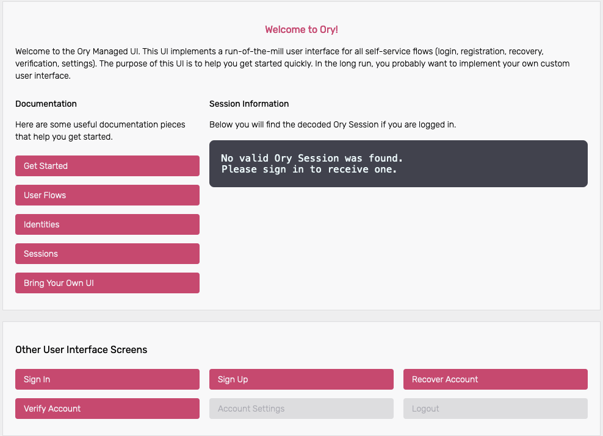
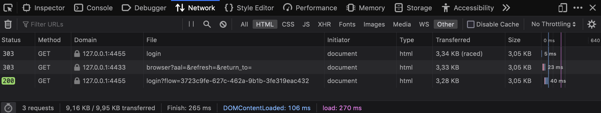
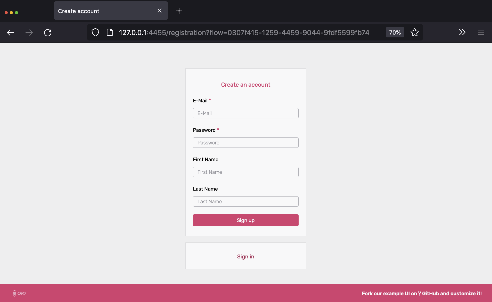
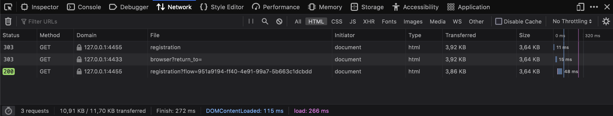
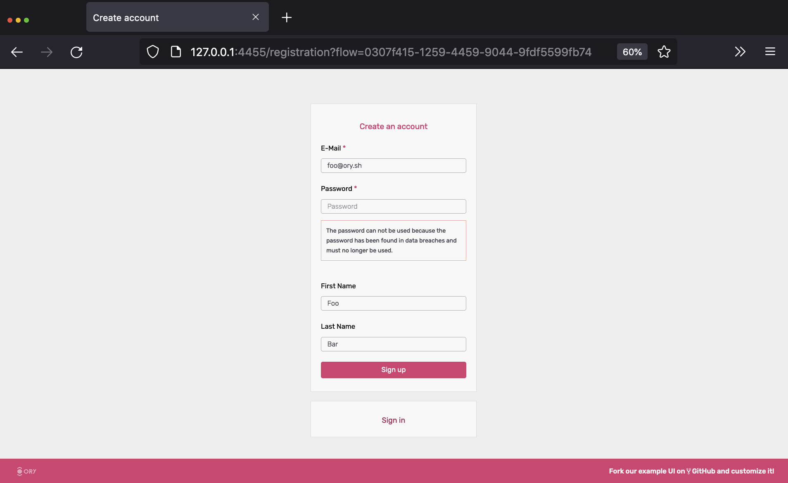
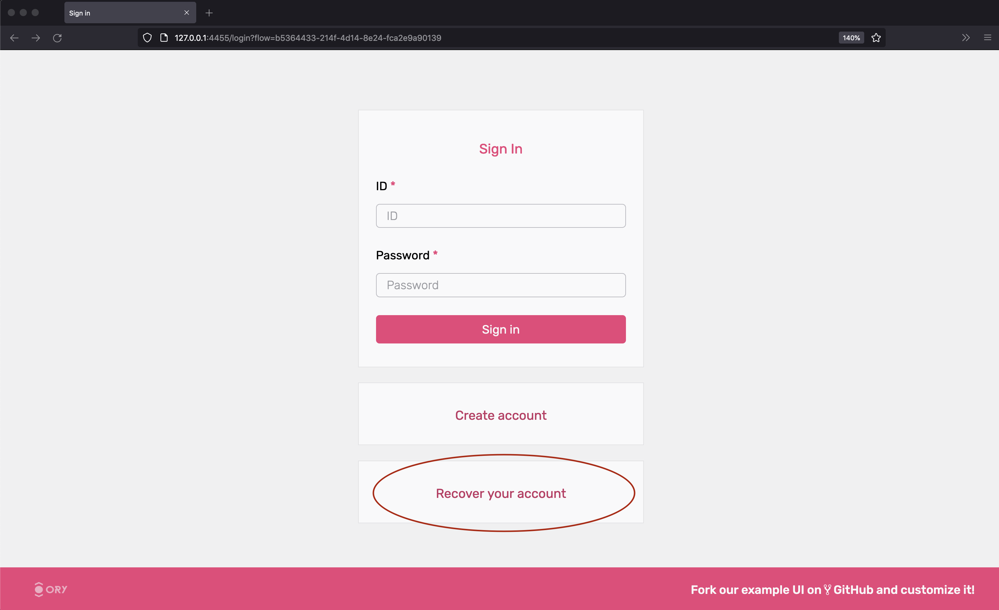
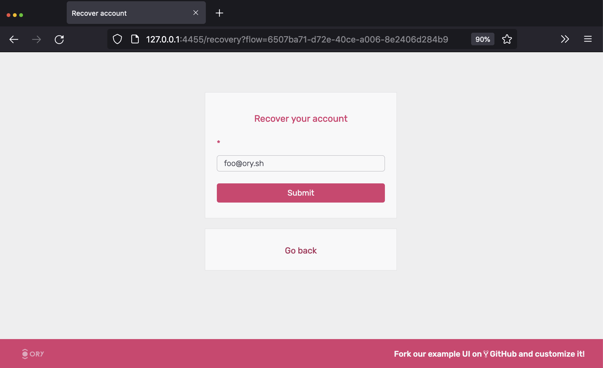
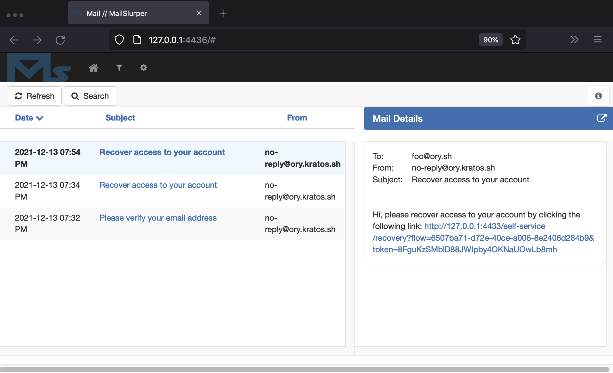
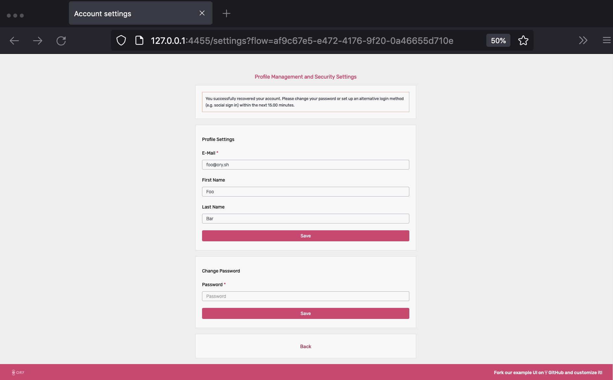

import Mermaid from '@theme/Mermaid'
import CodeFromRemote from '@theme/CodeFromRemote'

Ory Kratos has several moving parts and getting everything right from the
beginning can be challenging. This getting started guide will help you install
Ory Kratos and some additional dependencies so that you can see how it works.

Please be aware that this guide is not a replacement for studying the docs. You
must understand core concepts and APIs to use Ory Kratos productively. This is
merely a guide to get you set up with some examples.

<iframe
  width="560"
  height="315"
  src="https://www.youtube.com/embed/JhlIZ3aChXc"
  frameborder="0"
  allowfullscreen
/>

:::info

Video based on Ory Kratos 0.5.5 quickstart, so some routes a changed.

:::

## Use Case: Application Login and Registration

This section gives you some context on what we want to achieve and what tools we
need for that. You will also learn about the network set up we picked for this
guide.

This quickstart guide operates on the assumption that we are writing a NodeJS
app. This app is using nothing fancy - some ExpressJS and a bit of HTML
Templating using Handlebars. We do want to use TypeScript, but only because it's
more readable - not because we're doing anything out of the ordinary!

You could pick any technology here, of course. This works with Swift, ReactJS,
or Angular (client side) as well as with PHP, Ruby, Python, Java (server side) -
you name it! We picked NodeJS + TypeScript because we believe it is the easiest
to understand, and because JavaScript and NodeJS are universally understood and
easy to install.

We know our app will need to have some type of dashboard and that it needs
users. Therefore, we need:

- Login
- Logout
- Registration
- Profile management ("update first name", "update avatar", etc.)
- Credentials Management ("add a new recovery email", "change password", etc.)
- Account Recovery ("password reset")
- Email Verification
- Two Factor Authentication
- "Sign in with Google" and "Sign in with GitHub"

and of course:

- A dashboard that shows `Hello {{ traits.name.first }} {{ traits.name.last }}!`
  which is only visible when the user is signed in.

## Setup

As you might already know, Ory Kratos is API-only; it does not have a UI or HTML
templating engine. We will implement all the user-facing UIs like "dashboard",
"login", and "registration" in our NodeJS app!

To ensure that no one can access the dashboard without prior authentication
(login), we can use a small piece of code (here ExpressJS) to do that:

<CodeFromRemote
  lang="js"
  title="https://github.com/ory/kratos-selfservice-ui-node/blob/master/src/pkg/middleware.ts"
  src="https://raw.githubusercontent.com/ory/kratos-selfservice-ui-node/master/src/pkg/middleware.ts"
/>

:::info

Ory Kratos is not just an API: it uses cookies, HTTP redirects, anti-CSRF tokens
and more so you don't have to.

:::

The NodeJS app and Ory Kratos need to share cookies in order for anti-CSRF
tokens and login sessions to work. Because the quickstart runs on different
ports on `127.0.0.1` there is nothing we need to do to get this all working. In
environments where you have multiple sub-domains or reverse proxies, the set up
will be a bit more sophisticated. You can find more information about the
different set up possibilities in the
[Getting Cookies to Work on Multi-Domains Guide](guides/multi-domain-cookies.mdx).

Ory Kratos does not ship with an administrative user interface. You must
implement that yourself or choose the Ory Cloud offering (to be announced). In
this quickstart we will use Ory Kratos' CLI to interact with Ory Kratos' APIs.

The quickstart also comes with [MailSlurper](https://mailslurper.com), a mock
SMTP server the demo uses to show how email verification works.

### Clone Ory Kratos and Run it in Docker

To get this example working, you will need Git,
[Docker](https://docs.docker.com/get-docker/), and
[Docker Compose](https://docs.docker.com/compose/install/) installed on your
system. No other dependencies are required. Before you start, make sure that
Docker has enough disk space.

:::tip

This tutorial uses Docker-Compose volumes which have reported to run out of disk
space. Check the remaining disk space using `docker system df`. If the volumes
are above the 85% threshold,
[prune old Docker objects](https://docs.docker.com/config/pruning/) before you
start!

:::

:::tip

If you encounter build errors (e.g. network timeout), make sure that the network
is running correctly and run `make docker` again. If the problem persists, feel
free to [open an issue](https://github.com/ory/kratos/issues/new/choose).

:::

Let's clone Ory Kratos and run `docker-compose`:

```shell script
git clone https://github.com/ory/kratos.git
cd kratos
git checkout v0.8.0-alpha.3

docker-compose -f quickstart.yml -f quickstart-standalone.yml up --build --force-recreate
# If you have SELinux, run:
docker-compose -f quickstart.yml -f quickstart-selinux.yml -f quickstart-standalone.yml up --build --force-recreate
```

This might take a minute or two. Once the output slows down and logs indicate a
healthy system you're ready to roll! A healthy system will show something along
the lines of (the order of messages might be reversed):

```
kratos_1 | time="2020-01-20T14:52:13Z" level=info msg="Starting the admin httpd on: 0.0.0.0:4434"
kratos_1 | time="2020-01-20T14:52:13Z" level=info msg="Starting the public httpd on: 0.0.0.0:4433"
```

:::note

There are two important factors to get a fully functional system:

- You need to make sure that ports `4455`, `4433`, `4434`, and `4436`&nbsp;
  [are free](https://serverfault.com/questions/309052/check-if-port-is-open-or-closed-on-a-linux-server).
- Make sure to always use `127.0.0.1` as the hostname; never use `localhost`!
  This is important because browsers treat these two as separate domains and
  will therefore have issues with setting and using cookies correctly.

:::

There is no database being used in this example. Ory Kratos supports SQLite,
PostgreSQL, MySQL, and CockroachDB as database backends. For the quickstart,
we're mounting a persistent volume to store the SQLite database in.

Future guides will explain how to set up a production system.

### Network Architecture

This demo makes use of several services:

1. [Ory Kratos](https://github.com/ory/kratos)
   - Public ("Browser") API (port 4433)
   - Admin API (port 4434) - This is only made public so we can test via the
     CLI.
2. [NodeJS Selfservice UI](http://github.com/ory/kratos-selfservice-ui-node)
   - Public (port 4455) - an example application written in NodeJS that
     implements the login, registration, logout, dashboard, and other UIs.
3. [MailSlurper](https://github.com/mailslurper)
   - Public (port 4436) - a development SMTP server which Ory Kratos will use to
     send emails.

To better understand the application architecture, let's take a look at the
network configuration. This assumes that you have at least some understanding of
how Docker networks work:

<Mermaid
  chart={`
graph TD
subgraph hn[Host Network]
    B[Browser]
    B-->|Can access URLs via 127.0.0.1:4455|OKPHN
    B-->|Can access URLs via 127.0.0.1:4433|PAPI
    B-->|Can access UI via 127.0.0.1:4436|SMTPUI
    OKPHN([Selfservice UI exposed at :4455])
    SMTPUI([MailSlurper UI exposed at :4436])
    PAPI([Ory Kratos Public API exposed at :4433])
end
subgraph dn["Internal Docker Network (intranet)"]
    OKPHN-.->SA
    SMTPUI-.->SMTP
    PAPI-.->OK
    SA-->|Talks to and validates login sessions using|OK
    OK-->|Sends mail via|SMTP
    OK[Ory Kratos]
    SA["Selfservice UI (Ory Kratos SelfService UI Node Example)"]
    SMTP["SMTP Server (MailSlurper)"]
end
`}
/>

## Perform Registration, Login, and Logout

Enough theory, it's time to get this thing going! Let's start by trying to open
the dashboard - **go to
[127.0.0.1:4455/welcome](http://127.0.0.1:4455/welcome)**.

You should end up at the dashboard:



Under the section `Session Information` you can find the Ory Session details, as
there is no active session this is empty for now.

:::note

The rendered login form should be a standard HTML `<form>`. AJAX requests
require `credentials: 'include'`. This flow also works with Single Page Apps
(SPA) and frameworks like Angular or ReactJS. For more details about the
specific flows for SPAs head over to the [concept](concepts/index.md) chapter.

:::

Click `Sign In` to start a login flow. On the Sign In Screen you can see the
unique login `<flow_id>` e.g. `?flow=78e374d2-f36b-40ae-922d-e81f812ea897`
appended to the /login route in the URL.

Looking at the network stack, you can see two redirects happening:



Here's a play-by-play of what happened:

1. `/login` redirected you to
   `http://127.0.0.1:4433/self-service/login/browser`, which is one of Ory
   Kratos' APIs used for logging in browser-based applications.
2. Kratos handled `/self-service/login/browser` which created and persisted a
   new flow with `csrf_token`. Kratos would check no session exists, redirected
   the browser to `/login?flow=<flow_id>`. If a session exists already, the
   browser will be redirected to `urls.default_redirect_url` unless the query
   parameter `?refresh=true` was set.
3. The login UI handled the `/login` route, found the `<flow_id>` in the URL
   query parameter, and used it to make an HTTP request to
   `http://kratos:4433/self-service/login/flows?id=<flow_id>`. Notice the URI is
   `kratos:4433` because SecureApp is making a server-side HTTP request via
   Docker's private network to Ory Kratos' Admin API.
4. Ory Kratos responded with data which SecureApp used to render the HTML login
   form.

We can use `curl` to get an example of the payload that Ory Kratos responds
with. `GET` a valid `<flow_id>` or copy it from your browser and make a request
to `/self-service/login/`:

```shell-session
$ flowId=$(curl -s -X GET \
    -H "Accept: application/json" \
    http://127.0.0.1:4433/self-service/login/api | jq -r '.id')
$ curl -s -X GET \
    -H "Accept: application/json" \
    "http://127.0.0.1:4433/self-service/login/flows?id=$flowId" | jq
{
  "id": "f091ccf5-df85-493e-a9a3-de9b86925a45",
  "type": "api",
  "expires_at": "2021-12-13T18:31:57.1189985Z",
  "issued_at": "2021-12-13T18:21:57.1189985Z",
  "request_url": "http://127.0.0.1:4433/self-service/login/api",
  "ui": {
    "action": "http://127.0.0.1:4433/self-service/login?flow=f091ccf5-df85-493e-a9a3-de9b86925a45",
    "method": "POST",
    "nodes": [
      {
        "type": "input",
        "group": "default",
        "attributes": {
          "name": "csrf_token",
          "type": "hidden",
          "value": "",
          "required": true,
          "disabled": false,
          "node_type": "input"
        },
        "messages": [],
        "meta": {}
      },
      {
        "type": "input",
        "group": "password",
        "attributes": {
          "name": "password_identifier",
          "type": "text",
          "value": "",
          "required": true,
          "disabled": false,
          "node_type": "input"
        },
        "messages": [],
        "meta": {
          "label": {
            "id": 1070004,
            "text": "ID",
            "type": "info"
          }
        }
      },
      {
        "type": "input",
        "group": "password",
        "attributes": {
          "name": "password",
          "type": "password",
          "required": true,
          "disabled": false,
          "node_type": "input"
        },
        "messages": [],
        "meta": {
          "label": {
            "id": 1070001,
            "text": "Password",
            "type": "info"
          }
        }
      },
      {
        "type": "input",
        "group": "password",
        "attributes": {
          "name": "method",
          "type": "submit",
          "value": "password",
          "disabled": false,
          "node_type": "input"
        },
        "messages": [],
        "meta": {
          "label": {
            "id": 1010001,
            "text": "Sign in",
            "type": "info",
            "context": {}
          }
        }
      }
    ]
  },
  "created_at": "2021-12-13T18:21:57.121894Z",
  "updated_at": "2021-12-13T18:21:57.121894Z",
  "refresh": false,
  "requested_aal": "aal1"
}
```

Let's move on to the next flow - registration! Click on "Register new account",
which initiates a flow similar to the one we just used:



The network trace should look familiar by now:



To get an example of the payload for a registration flow, we can use the same
`curl` request as above, now to the `self-service/registration` endpoint.

```shell script
$ flowId=$(curl -s -X GET \
    -H "Accept: application/json" \
    http://127.0.0.1:4433/self-service/registration/api | jq -r '.id')

$ curl -s -X GET \
    -H "Accept: application/json" \
    "http://127.0.0.1:4433/self-service/registration/flows?id=$flowId" | jq
{
  "id": "d62a3a8d-d3f3-4ca5-af54-0e8747b53b41",
  "type": "api",
  "expires_at": "2021-12-13T19:55:06.9350485Z",
  "issued_at": "2021-12-13T19:45:06.9350485Z",
  "request_url": "http://127.0.0.1:4433/self-service/registration/api",
  "ui": {
    "action": "http://127.0.0.1:4433/self-service/registration?flow=d62a3a8d-d3f3-4ca5-af54-0e8747b53b41",
    "method": "POST",
    "nodes": [
      {
        "type": "input",
        "group": "default",
        "attributes": {
          "name": "csrf_token",
          "type": "hidden",
          "value": "",
          "required": true,
          "disabled": false,
          "node_type": "input"
        },
        "messages": [],
        "meta": {}
      },
      {
        "type": "input",
        "group": "password",
        "attributes": {
          "name": "traits.email",
          "type": "email",
          "required": true,
          "disabled": false,
          "node_type": "input"
        },
        "messages": [],
        "meta": {
          "label": {
            "id": 1070002,
            "text": "E-Mail",
            "type": "info"
          }
        }
      },
      {
        "type": "input",
        "group": "password",
        "attributes": {
          "name": "password",
          "type": "password",
          "required": true,
          "disabled": false,
          "node_type": "input"
        },
        "messages": [],
        "meta": {
          "label": {
            "id": 1070001,
            "text": "Password",
            "type": "info"
          }
        }
      },
      {
        "type": "input",
        "group": "password",
        "attributes": {
          "name": "traits.name.first",
          "type": "text",
          "disabled": false,
          "node_type": "input"
        },
        "messages": [],
        "meta": {
          "label": {
            "id": 1070002,
            "text": "First Name",
            "type": "info"
          }
        }
      },
      {
        "type": "input",
        "group": "password",
        "attributes": {
          "name": "traits.name.last",
          "type": "text",
          "disabled": false,
          "node_type": "input"
        },
        "messages": [],
        "meta": {
          "label": {
            "id": 1070002,
            "text": "Last Name",
            "type": "info"
          }
        }
      },
      {
        "type": "input",
        "group": "password",
        "attributes": {
          "name": "method",
          "type": "submit",
          "value": "password",
          "disabled": false,
          "node_type": "input"
        },
        "messages": [],
        "meta": {
          "label": {
            "id": 1040001,
            "text": "Sign up",
            "type": "info",
            "context": {}
          }
        }
      }
    ]
  }
}
```

If we try to sign up using a password like `123456`, Krato's password policy
will complain:



Setting a password that doesn't violate these policies, we will be immediately
redirected to the dashboard:


By clicking the "logout" icon in the top right, you will be redirected to the
login screen again where you will be able to use your credentials to log back in
again. Exciting!

### Understanding How Login and Registration Works

Head over to the [Self-Service Flows Chapter](self-service.mdx) for an in-depth
explanation of how each individual flow works.

### Email Verification

As you've signed up, an email was sent to the email address you used. Because
the quickstart uses a fake SMTP server, the email did not arrive in your inbox.
You can retrieve the email however by opening the MailSlurper UI at
[127.0.0.1:4436](http://127.0.0.1:4436).

You should see something like this:


If not, hard refresh the tab or click on the home icon in the menu bar.

Next, click the verification link. You will end up at the dashboard, with a
verified email address (check the `verified` and `verified_at` field in the JSON
response):

```json {31}
{
  "id": "5fe6b562-c5a6-4adf-a3a7-a1e588c11c66",
  "active": true,
  "expires_at": "2021-12-14T19:35:21.7271879Z",
  "authenticated_at": "2021-12-13T19:35:21.7271879Z",
  "authenticator_assurance_level": "aal1",
  "authentication_methods": [
    {
      "method": "password",
      "completed_at": "2021-12-13T19:35:21.7271762Z"
    }
  ],
  "issued_at": "2021-12-13T19:35:21.7271879Z",
  "identity": {
    "id": "0435468f-5b39-4f06-8257-af418412891d",
    "schema_id": "default",
    "schema_url": "http://127.0.0.1:4433/schemas/default",
    "state": "active",
    "state_changed_at": "2021-12-13T19:32:48.7715418Z",
    "traits": {
      "name": {
        "first": "Foo",
        "last": "Bar"
      },
      "email": "foo@ory.sh"
    },
    "verifiable_addresses": [
      {
        "id": "9fccf5c1-c374-4a15-8f01-1fd5cb3bea55",
        "value": "foo@ory.sh",
        "verified": true,
        "via": "email",
        "status": "completed",
        "verified_at": "2021-12-13T19:34:45.4343846Z",
        "created_at": "2021-12-13T19:32:48.775138Z",
        "updated_at": "2021-12-13T19:34:53.449022Z"
      }
    ],
    "recovery_addresses": [
      {
        "id": "0df6ddf6-780b-4c3c-ba31-4a349a2a1bc5",
        "value": "foo@ory.sh",
        "via": "email",
        "created_at": "2021-12-13T19:32:48.775823Z",
        "updated_at": "2021-12-13T19:34:53.449207Z"
      }
    ],
    "created_at": "2021-12-13T19:32:48.773627Z",
    "updated_at": "2021-12-13T19:32:48.773627Z"
  }
}
```

To re-request the verification email, fill out the form at
[127.0.0.1:4455/verification](http://127.0.0.1:4455/verification).

To learn more about verification recovery, head over to the
[Email and Phone Verification and Account Activation Documentation](self-service/flows/verify-email-account-activation.mdx).

### Account Recovery

The quickstart has account recovery enabled. To recover an account, log out and
click on "Recover Account":



The next screen shows a HTML form where you enter your email address:



Hit "submit" and check the emails for the account recovery message:



Click the link, and change your password:



You are now able to sign in with the new password. To learn more about account
recovery, head over to the
[Account Recovery Documentation](self-service/flows/account-recovery.mdx).

#### Configuration

You can find all configuration files used for this quickstart guide in
[`./contrib/quickstart/kratos`](https://github.com/ory/kratos/tree//contrib/quickstart/kratos/email-password)
, [`./quickstart.yml`](https://github.com/ory/kratos/blob//quickstart.yml), and
[`./quickstart-standalone.yml`](https://github.com/ory/kratos/blob//quickstart-standalone.yml).
To understand what each of those configuration files does, consult the other
chapters of this documentation.

:::note

To get a minimal version of Ory Kratos running, you need to set configuration
values for
[`identity.default_schema_url`](https://github.com/ory/kratos/blob//contrib/quickstart/kratos/email-password/kratos.yml#L75)
and [`DSN`](https://github.com/ory/kratos/blob//quickstart.yml#L42). You should
also configure
[`selfservice.flows.*.ui_url`](https://github.com/ory/kratos/blob//contrib/quickstart/kratos/email-password/kratos.yml#L24)
or else Kratos will use fallback URLs.

:::

This is just scratching the surface of Ory Kratos, see [Next Steps](#next-steps)
for pointers how to continue.

## Cleaning Up Docker

To clean everything up, you need to bring down the Docker Compose environment
and remove all mounted volumes.

```shell script
docker-compose -f quickstart.yml down -v
docker-compose -f quickstart.yml rm -fsv
```

## Next Steps

Here is some information should you want to modify the quickstart:

**Social Login**

[Step-by-step guides](guides/sign-in-with-github-google-facebook-linkedin/) to
add sign up and login with popular OIDC providers to the Ory Kratos Quickstart,
for example:

- [GitHub](guides/sign-in-with-github-google-facebook-linkedin/#github)
- [Google](guides/sign-in-with-github-google-facebook-linkedin/#google)
- [Facebook](guides/sign-in-with-github-google-facebook-linkedin/#facebook) and
  [many more](guides/sign-in-with-github-google-facebook-linkedin/).

**Use a different database**

If you want to run the quickstart with PostgreSQL, run the following
docker-compose:
`docker-compose -f quickstart.yml -f quickstart-standalone.yml -f quickstart-postgres.yml up --build --force-recreate`

If you want to run the quickstart with CockroachDB, run the following
docker-compose:
`docker-compose -f quickstart.yml -f quickstart-standalone.yml -f quickstart-crdb.yml up --build --force-recreate`

If you want to run the quickstart with MySQL, run the following docker-compose:
`docker-compose -f quickstart.yml -f quickstart-standalone.yml -f quickstart-mysql.yml up --build --force-recreate`

**Change ports**

If you want to change ports for the SelfService-UI, you need to change them in
`quickstart.yml` as well as in the
`contrib/quickstart/kratos/email-password/kratos.yml` accordingly.

Note that you also need to change the ports for flows (error, settings,
recovery, verification, logout, login, registration).

The same procedure applies if you want to change ports for the Public UI/Admin
UI or the Mailslurper.

**Hooks**

To change the redirects happening after registration,login or a settings change,
take a look at this document: [Hooks](self-service/hooks.mdx).

If you delete the `session` hook from `kratos.yml`, the user will _not_ be
immediately signed in after registration.

### Quickstart Configuration

In this tutorial we use a simplified configuration. You can find it in
[`contrib/quickstart/kratos/email-password/kratos.yml`](https://github.com/ory/kratos/blob/master/contrib/quickstart/kratos/email-password/kratos.yml).
In the same place the
[identity schema](https://github.com/ory/kratos/blob/master/contrib/quickstart/kratos/email-password/identity.schema.json)
used in the tutorial can be found. The configuration gets loaded in
docker-compose as specified in the
[`quickstart.yml`](https://github.com/ory/kratos/blob/master/quickstart.yml).

<CodeFromRemote
  lang="yml"
  link="https://github.com/ory/kratos/blob/master/quickstart.yml"
  src="https://github.com/ory/kratos/blob/master/contrib/quickstart/kratos/email-password/kratos.yml"
/>

Have a look at the [reference configuration](./reference/configuration.md) for
further information on possible configuration options.
