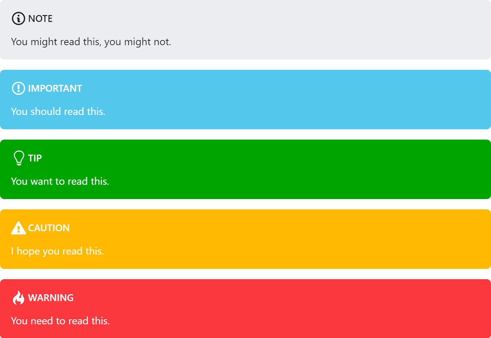

[](https://travis-ci.com/elviswolcott/remark-admonitions)
[](https://www.npmjs.com/package/remark-admonitions)
# remark-admonitions

> A [remark](https://github.com/remarkjs/remark) plugin for admonitions designed with Docusaurus v2 in mind.

> `remark-admonitions` is now included out-of-the-box with `@docusaurus/preset-classic`!


# Installation

`remark-admonitions` is available on NPM.

```bash
npm install remark-admonitions
```

## unified + remark
If you're using unified/remark, just pass the plugin to `use()`

For example, this will compile `input.md` into `output.html` using `remark`, `rehype`, and `remark-admonitions`.

```javascript
const unified = require('unified')
const markdown = require('remark-parse')
// require the plugin
const admonitions = require('remark-admonitions')
const remark2rehype = require('remark-rehype')
const doc = require('rehype-document')
const format = require('rehype-format')
const html = require('rehype-stringify')
const vfile = require('to-vfile')
const report = require('vfile-reporter')

const options = {}

unified()
  .use(markdown)
  // add it to unified
  .use(admonitions, options)
  .use(remark2rehype)
  .use(doc)
  .use(format)
  .use(html)
  .process(vfile.readSync('./input.md'), (error, result) => {
      console.error(report(error || result))
      if (result) {
        result.basename = "output.html"
        vfile.writeSync(result)
      }
  })
```

## Docusaurus v2

`@docusaurus/preset-classic` includes `remark-admonitions`.

If you aren't using `@docusaurus/preset-classic`, `remark-admonitions` can still be used through passing a `remark` plugin to MDX. 
# Usage

Admonitions are a block element. 
The titles can include inline markdown and the body can include any block markdown except another admonition.

The general syntax is

```markdown
:::keyword optional title
some content
:::
```

For example,

```markdown
:::tip pro tip
`remark-admonitions` is pretty great!
:::
```


The default keywords are `important`, `tip`, `note`, `warning`, and `danger`.
Aliases for `info` => `important`, `success` => `tip`, `secondary` => `note` and `danger` => `warning` have been added for Infima compatibility.

# Options

The plugin can be configured through the options object.

## Defaults

```ts
const options = {
  customTypes: customTypes, // additional types of admonitions
  tag: string, // the tag to be used for creating admonitions (default ":::")
  icons: "svg"|"emoji"|"none", // the type of icons to use (default "svg")
  infima: boolean, // wether the classes for infima alerts should be added to the markup
}
```

## Custom Types

The `customTypes` option can be used to add additional types of admonitions. You can set the svg and emoji icons as well as the keyword. You only have to include the svg/emoji fields if you are using them. 
The ifmClass is only necessary if the `infima` setting is `true` and the admonition should use the look of an existing Infima alert class.

```ts
const customTypes = {
  [string: keyword]: {
    ifmClass: string,
    keyword: string,
    emoji: string,
    svg: string,
  } | string
}
```

For example, this will allow you to generate admonitions will the `custom` keyword.

```js
customTypes: {
  custom: {
    emoji: '💻',
    svg: '<svg xmlns="http://www.w3.org/2000/svg" width="16" height="16" viewBox="0 0 16 16"><path fill-rule="evenodd" d="M15 2H1c-.55 0-1 .45-1 1v9c0 .55.45 1 1 1h5.34c-.25.61-.86 1.39-2.34 2h8c-1.48-.61-2.09-1.39-2.34-2H15c.55 0 1-.45 1-1V3c0-.55-.45-1-1-1zm0 9H1V3h14v8z"></path></svg>'
  }
}
```

To create an alias for an existing type, have the value be the keyword the alias should point to.

```js
customTypes: {
  alias: "custom"
}
```

The generated markup will include the class `admonition-{keyword}` for styling.

If the `infima` option is `true`, the classes `alert alert--{type}` will be added to inherit the default Infima styling.

# Styling

You'll have to add styles for the admonitions. With Docusaurus, these can be added to `custom.css`. 

## Infima (Docusaurus v2)

The Infima theme (`styles/infima.css`) is used by `@docusaurus/preset-classic`.



## Classic (Docusaurus v1)

The classic theme (`styles/classic.css`) replicates the look of `remarkable-admonitions` and Docusaurus v1.


# Credit

Syntax and classic theme based on [`remarkable-admonitions`](https://github.com/favoloso/remarkable-admonitions).

The SVG icons included are from [GitHub Octicons](https://octicons.github.com).