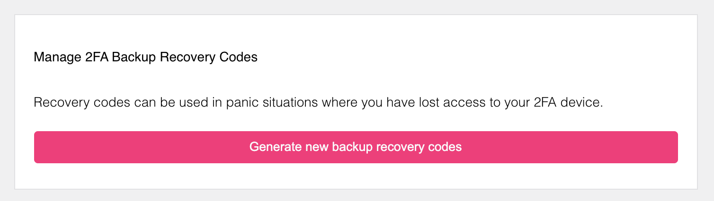

Lookup secrets (`lookup_secret`) are passwords generated by the server. These
passwords can only be used once, and the end-user typically downloads them,
stores them in their password manager, or writes them down. Lookup secrets are
commonly used when the end-user loses access to their TOTP or WebAuthn device!



## Configuration

Enabling this method is as easy as setting

```yaml title="kratos.config.yml"
selfservice:
  methods:
    lookup_secret:
      enabled: true
```

## Identity Credentials

The `lookup_secret` method would generate a credentials block as follows:

```yaml
credentials:
  password:
    id: lookup_secret
    identifiers:
      # This is the identity's ID
      - 802471b9-06f5-49d4-a88d-5e7d6bcfed22
    config:
      recovery_codes:
        - code: 1bc6bea
        - code: 1bc6bea
          used_at: 2021-10-14T07:38:51Z
```
