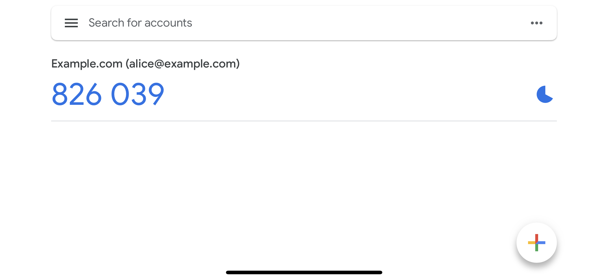
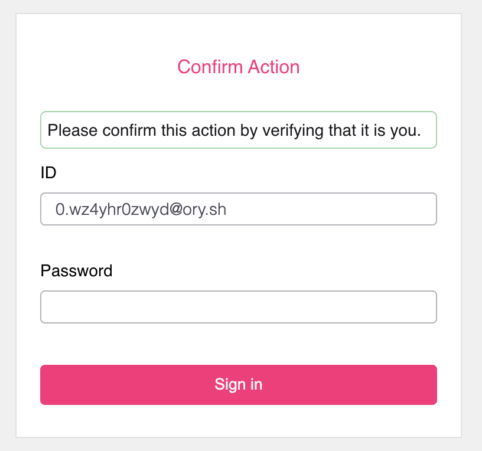
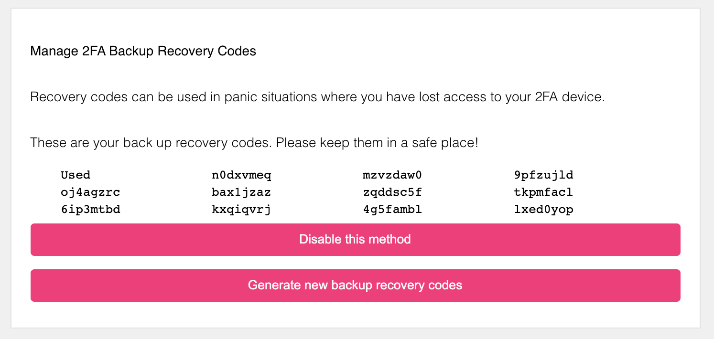
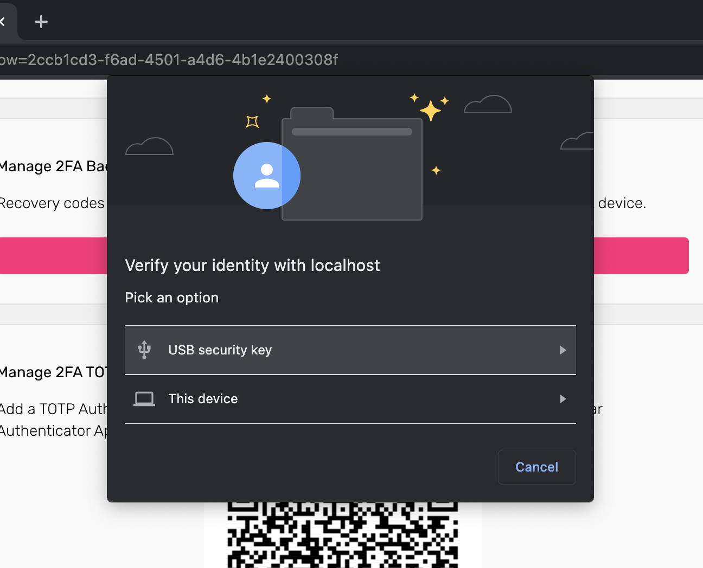

Ory Kratos supports two-factor authentication. Depending on the devices used,
you might want to call this two-factor verification depending on which features
you have enabled. Learn more about the distinction between two-factor
authentication and two-factor verification in this excellent
[1password](https://blog.1password.com/totp-for-1password-users/) blog post!

There are four key components available in Ory Kratos with regard to
multi-factor authentication. For this guide, we will assume that you are using
the Ory Cloud Managed UI available at
[github.com/ory/kratos-selfservice-ui-node](https://github.com/ory/kratos-selfservice-ui-node).
At the end of this guide you will find details and ideas on how to implement
your own UI with Ory Kratos' MFA features.

## Terminology

Before we start let's establish the key terminology to make the following
sections easier to understand!

### Authenticator Assurance Level (AAL)

The Authenticator Assurance Level (AAL) has two possible values:

- `aal1`: Implies that the identity has completed only one authentication factor
  (`password`, `oidc`).
- `aal2`: Implies that the identity has completed the first (`password`, `oidc`)
  and the second (`totp`, `lookup_secrets`, `webauthn`) authentication factor
  (e.g.: `password` + `totp`, `oidc` + `webauthn`, ...). First authentication
  factors can not be combined to gain `aal2` (e.g. `password` + `oidc` = `aal1`,
  not `aal2`)!

### Authentication Method Reference (AMR)

The Authentication Method Reference (AMR) is an array of authentication methods
that were used over the lifetime of an Ory Session. In an Ory Session, this will
have the following layout:

```json5 title="Example Ory Session JSON Payload"
{
  id: '6b51a3f2-6a2c-4557-90a8-4e23de7072aa',
  active: true,
  // ...
  authenticator_assurance_level: 'aal2',
  authentication_methods: [
    {
      method: 'password',
      completed_at: '2021-10-14T09:37:53.872104Z'
    },
    {
      method: 'lookup_secret',
      completed_at: '2021-10-14T09:41:16.771859Z'
    }
  ]
  // ...
}
```

The methods can be one of `password`, `oidc`, `totp`, `webauthn`,
`lookup_secrets`. A method can be included more than once, for example when the
identity refreshes their Ory Session by re-authenticating with e.g. their
password:

```json5 title="Example Ory Session JSON Payload"
{
  id: '6b51a3f2-6a2c-4557-90a8-4e23de7072aa',
  active: true,
  // ...
  authenticator_assurance_level: 'aal2',
  authentication_methods: [
    {
      method: 'password',
      completed_at: '2021-10-14T09:37:53.872104Z'
    },
    {
      method: 'lookup_secret',
      completed_at: '2021-10-14T09:41:16.771859Z'
    },
    {
      method: 'password',
      completed_at: '2021-10-14T12:00:00.134567Z'
    }
  ]
  // ...
}
```

## Strict and Lax Multi-Factor Authentication

Before jumping into the concrete MFA modules, we take a lok at "Soft
Multi-Factor Authentication". Ory Kratos has two endpoints which require an Ory
Session Token or Ory Session Cookie to function:

- [`/sessions/whoami`](../reference/api.mdx#operation/toSession)
- The [self-service setting flow](../self-service/flows/user-settings.mdx)

When you enable one of the 2FA methods, you can configure when an Ory Session
Token or Ory Session Cookie is considered "valid" for these two endpoints:

```yaml title="kratos.config.yml"
# ...
selfservice:
  flows:
    settings:
      required_aal: aal1
# ...
session:
  whoami:
    required_aal: aal1
# ...
```

The field `required_aal` can be one of:

- `highest_available` (default): If set, requires identities who have set up a
  second factor (e.g. `totp`, `webauthn`) to have an Ory Session where both
  factors (e.g. `password` + `totp`) have been used to authenticated.
- `aal1`: Even if an identity has a second factor set up, an Ory Session with
  only one factor (e.g. `oidc`, `password`) is enough to access it.

For example, if you want your users to sign in without forcing the second
factor, you could set:

```yaml title="kratos.config.yml"
# ...
session:
  whoami:
    required_aal: aal1
# ...
```

When the user is doing something that needs more security (e.g. a bank
transfer), you could add a check which only allows Ory Sessions that have `aal2`
to access that feature.

The Ory Session, which you can get by calling the
[`/sessions/whoami`](../reference/api.mdx#operation/toSession) endpoint,
contains the session's `authenticator_assurance_level`. For a session which only
completed the first factor, this would be:

```json5 title="GET /session/whoami"
{
  id: '6b51a3f2-6a2c-4557-90a8-4e23de7072aa',
  active: true,
  // ...
  authenticated_at: '2021-10-14T09:37:53.877216Z',
  authenticator_assurance_level: 'aal1'
  // ...
}
```

A session that has completed the second factor, this would be:

```json5 title="GET /session/whoami"
{
  id: '6b51a3f2-6a2c-4557-90a8-4e23de7072aa',
  active: true,
  // ...
  authenticated_at: '2021-10-14T09:37:53.877216Z',
  authenticator_assurance_level: 'aal2'
  // ...
}
```

If `highest_available` is configured for the `/session/whoami` endpoint, then
Ory Kratos will instruct the user interface - if it is a browser flow - to
redirect to the 2FA screen after the end-user signs in with their first factor.

## Requesting Second Factor Authentication

When an end-user is signed in you may prompt them to provide their second factor
by initiating a new Login using the
[`/self-service/login/browser`](../reference/api#operation/initializeSelfServiceLoginFlowForBrowsers)
or
[`/self-service/login/api`](../reference/api#operation/initializeSelfServiceLoginFlowWithoutBrowser)
API and setting the `aal` parameter to `aal2`. Once the end-user has provided
their second factor, the method (e.g. `totp`) will be added to the Or Session
AMR, the Ory Session AAL will be set to `aal2`, and `authenticated_at` will be
set to the current time.

```
/self-service/login/browser?aal=aal2
/self-service/login/api?aal=aal2
```

If the Ory Session has `aal2` already, this will error. In that case you can
request to refresh the session using the second factor:

```
/self-service/login/browser?refresh=true&aal=aal2
/self-service/login/api?refresh=true&aal=aal2
```

## Time-Based One-Time Password (TOTP) / Authenticator App

Time-Based One-Time Password (TOTP) is a standardized algorithm (see
[RFC6238](https://datatracker.ietf.org/doc/html/rfc6238)) that is used by apps
supported by apps like Google Authenticator
([iOS](https://apps.apple.com/us/app/google-authenticator/id388497605),
[Android](https://play.google.com/store/apps/details?id=com.google.android.apps.authenticator2)),
[1Password](https://support.1password.com/one-time-passwords/),
[Bitwarden](https://bitwarden.com/help/article/authenticator-keys/), and many
others.



You can enable TOTP in your Ory Kratos config:

```yaml title="kratos.config.yml"
selfservice:
  methods:
    totp:
      enabled: true
      config:
        # The issuer (e.g. a domain name) will be shown in the TOTP app (e.g. Google Authenticator). It helps the user differentiate between different codes.
        issuer: Example.com
```

To help the user identify the correct code in their TOTP authenticator app, you
should set the `issuer` (see code example above) to your brand name or domain
name. However, users might have multiple identities registered in your system.
To help them distinguish between them, you can specify a traits in your Identity
Schema which should be the TOTP account name (in the screenshot above
`alice@example.org`):

```patch title="identity.schema.json"
{
  $schema: 'http://json-schema.org/draft-07/schema#',
  type: 'object',
  properties: {
    traits: {
      type: 'object',
      properties: {
        email: {
          type: 'string',
          format: 'email',
          title: 'Your E-Mail',
          minLength: 3,
          'ory.sh/kratos': {
            credentials: {
              // ...
+             totp: {
+               account_name: true
+             }
            }
            // ...
          }
        }
        // ...
      }
      // ...
    }
  }
}
```

In the settings UI, the user will be presented with a QR code, a secret which
can be used instead of the QR code, and a field to enter a TOTP password
generated by the linked TOTP app.


To complete the process, the Ory Session must be
[privileged](../concepts/session.mdx#privileged-session). Once set up, the
end-user can unlink the TOTP device if e.g. it is lost:


### Writing E2E Tests for TOTP

If you wish to write TOTP tests, take a look at
[how we solve E2E tests for TOTP](https://github.com/ory/kratos/blob/fc2cecfbeab811aa1a851f953b6bc2a4c119c412/test/e2e/cypress/integration/profiles/mfa/totp.spec.ts).

## Lookup Secrets

Lookup secrets are passwords generated by the server. These passwords can only
be used once, and the end-user typically downloads them, stores them in their
password manager, or writes them down. Lookup secrets are commonly used when the
end-user loses access to their TOTP or WebAuthn device!

On your settings UI, this method could look as follows. First, the end-user
generates new lookup secrets.


The end-user must confirm these lookup secrets. This action requires a
[privileged Ory Session](../concepts/session.mdx#privileged-session) and the
user might be prompted to confirm the action by re-authenticating!



Once confirmed, the end-user can use these lookup secrets as a second factor!
When a code was used,



:::warning

The end-user must ensure to re-generate lookup secrets before all lookup secrets
have been used up!

:::

Lookup secrets are known by several names. Google for example calls them "Backup
Codes". Another common name is "2FA Recovery Codes".

You can enable this method in your Ory Kratos config:

```yaml title="kratos.config.yml"
selfservice:
  methods:
    lookup_secret:
      enabled: true
```

## FIDO2 / U2F WebAuthn

The Web Authentication Browser API (also known as WebAuthn) is a
[specification](https://w3c.github.io/webauthn/) written by the
[W3C](https://www.w3.org/) and [FIDO](https://fidoalliance.org/). The WebAuthn
API allows servers to register and authenticate users using public key
cryptography instead of a password. Common use cases for WebAuthn are

- using a USB, NFC, or Bluetooth low energy device (e.g.
  [YubiKey](https://www.yubico.com)) to authenticate
- using an Operating System "platform module" (e.g. TouchID, FaceID, Windows
  Hello Face, Android Biometric Authentication, ...)

:::info

WebAuthN is a Browser standard. It does not work on native mobile apps!

:::

Configuring WebAuthn correctly is imperative, because the authentication will
fail if something is not configured correctly.

```yaml title="kratos.config.yml"
selfservice:
  flows:
  methods:
    webauthn:
      enabled: true
      config:
        rp:
          # This MUST be your top-level-domain
          id: example.org
          # This MUST be the exact URL of the page which will prompt for WebAuthn!
          # Only the scheme (https / http), host (auth.example.org), and port (4455) are relevant. The
          # path is irrelevant
          origin: http://auth.example.org:4455
          # A display name which will be shown to the user on her/his device.
          display_name: Ory
```

Once the end-user triggers the WebAuthn process, the browser will show a
WebAuthn prompt:



:::info

Please be aware that implementing WebAuthN in your own UI can be challenging,
depending on which framework to use. Please check our
[reference implementations](./custom-ui.mdx) to see how we solved it for
different app types (web, single page app).

:::

### Writing E2E Tests

You will need a browser to run E2E tests using WebAuthn. Take a look at our
[E2E test for WebAuthn](https://github.com/ory/kratos/blob/fc2cecfbeab811aa1a851f953b6bc2a4c119c412/test/e2e/cypress/integration/profiles/mfa/webauthn.spec.ts)
for [Cypress](https://www.cypress.io). You can find more information about the
approach for Cypress in
[cypress#6991](https://github.com/cypress-io/cypress/issues/6991#issuecomment-612888645).

## Build Your Own UI

The major benefit of Ory Kratos is that you can bring your own login,
registration, account recovery, ... user-interface. You can write that
user-interface in any language or framework! We have
[reference UI implementations](../concepts/ui-user-interface.mdx) available to
help you get started!
